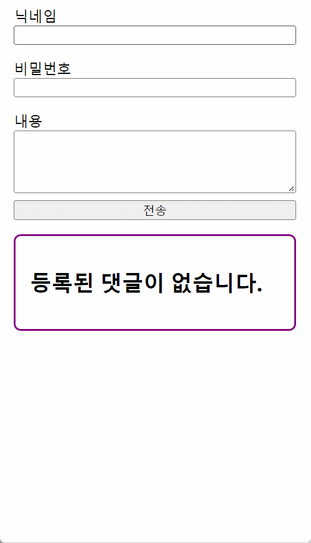

# Study React adding TypeScript, Redux Toolkit and styled-components

## 목차

- [개요](#overview)
  - [레포지토리 안내](#the-challenge)
  - [구현 예시](#screenshot)
- [작업 사항](#my-process)
  - [기술 스택](#built-with)
  - [학습 및 문제 해결 사항](#what-i-learned)
  - [추가 개발 희망 사항](#continued-development)
  - [참고 자료 링크](#useful-resources)
- [제작자](#author)
- [후기](#acknowledgments)

## 개요

### 레포지토리 안내

이 프로젝트는 TypeScript 환경이 갖춰진 React를 학습하기 위한 프로젝트입니다.
단순히 React를 활용할 뿐만 아니라 연관 라이브러리인 Redux Toolkit 등의 다른 라이브러리들을 적용해보고,  
해당 라이브러리들의 타입을 정의하고 사용하는 연습을 하기 위해 생성했습니다.

### 구현 예시



## 작업 사항

### 기술 스택

- HTML5
- CSS3
- TypeScript
- React
- Redux Toolkit
- styled-components

### 학습 및 문제 해결 사항

### 1️⃣ TypeScript와 Redux가 포함된 Create-React-App 패키지 설치

[https://github.com/reduxjs/cra-template-redux-typescript](https://github.com/reduxjs/cra-template-redux-typescript)

위의 레포지토리의 `README.md`를 통해 아래의 터미널 명령어를 확인할 수 있다.

```tsx
npx create-react-app my-app --template redux-typescript

# or

yarn create react-app my-app --template redux-typescript
```

내용대로 터미널에 설치해서 프로젝트를 만들어주자.

### 2️⃣ 추가 환경 설치 및 적용 (styled-components의 예)

이전에는 기존 템플릿 환경에서만 사용했다면, 이번에는 추가적인 라이브러리나 프레임워크를 직접 설치해봤다.

React로 CSS를 관리할 때는 CSS in JS 라이브러리인 styled-components를 많이 활용했기 때문에, 여기서도 해당 패키지를 설치해보고자 한다.

우선 아래와 같이 터미널 명령어를 통해 라이브러리를 설치해주자.

```tsx
npm install styled-components
```

설치가 완료했다면, 이제 `.tsx` 파일을 하나 만들어 `styled` 컴포넌트를 하나 생성해보자.
해보면 `.jsx` 때와는 다르게 정상적으로 styled-components의 인식이 잘 안 될 것이다.

package.json 파일을 열어 의존성(dependencies) 내역들을 확인해보면,


위와 같이 리스트가 나타나는데, TypeScript의 경우에는 JavaScript 라이브러리가 TypeScript로 번역해주는, 즉 컴파일해주는 `@types` 라이브러리가 필요한데 현재 styled-components에는 의존성에 과련 패키지가 존재하지 않는다.

따라서 아래의 터미널 명령어를 입력해 설치해주자.

```tsx
npm install @types/styled-components
```

여기까지 했으면, 일단락되겠지만 경우에 따라서는 위의 리스트에 추가되지 않는 경우가 있다.
그 때는 설치한 해당 패키지의 버전을 확인 후, 의존성에 추가해주도록 하자.

현재 설치된 라이브러리나 프레임워크 패키지의 버전을 알 수 있는 명령어는 아래와 같다.

```tsx
npm show (라이브러리 혹은 프레임워크 패키지명) version
```

여기서는 `@types/styled-components`의 버전을 확인했으며 확인 후 아래와 같이 의존성에 추가했다.


이제 다시 아까 생성했던 `.tsx` 파일에 `styled` 컴포넌트를 생성해보면 `styled`가 정상적으로 적용되는 것을 볼 수 있다.

### 3️⃣ type을 생성하여 children prop을 받아오기

React 18 버전부터 React 내의 TypeScript 타입 정의에 Function Components에서는 `props`에 `children`을 받아오는 `PropsWithChildren` 항목이 빠져있다.

따라서, `children`을 받아오게 하기 위해서는 `children`을 받아올 수 있는 타입을 새로 만들어내고, 이를 Function Components에 적용했다.

```tsx
export type Props = {
  children?: React.ReactNode;
};
```

React에 있는 노드들을 가리키는 `React.ReactNode`라는 타입을 정의해줌으로서 `Props`라는 타입을 새로 생성해줬다.

이제 이렇게 지정한 타입을 `export`를 붙여줌으로서 여기저기에 사용할 수 있게 했으므로, 아래의 `Layout` 컴포넌트에 해당 타입을 제네릭 타입으로 지정했다.

```tsx
import React from "react";
import styled from "styled-components";
import { Props } from "../App";

const Layout: React.FC<Props> = (props) => {
  return <LayoutContainer>{props.children}</LayoutContainer>;
};

export default Layout;
```

`Props`를 제네릭 타입으로 정의해놨기 때문에 이제 매개변수인 `props`를 통해 chilren에 접근할 수 있게 됐으므로, 위의 코드와 같이 `children`을 불러오는 것이 가능해졌다.

위의 방식이 싫다면, 아래와 같이 `index.d.ts` 파일에서 `React.FC` 타입을 정의한 `interface`인 `FunctionComponent`에서 `props`의 타입 정의에 `PropsWithChildren`을 붙여주자.

```tsx
type FC<P = {}> = FunctionComponent<P>;

interface FunctionComponent<P = {}> {
  (props: PropsWithChildren<P>, context?: any): ReactElement<any, any> | null;
  propTypes?: WeakValidationMap<P> | undefined;
  contextTypes?: ValidationMap<any> | undefined;
  defaultProps?: Partial<P> | undefined;
  displayName?: string | undefined;
}
```

### 4️⃣ 구조 분해 할당 문법에서의 타입 정의

JavaScript에서는 구조 분해 할당 문법을 사용할 때, 아래와 같이 적용했다.

```tsx
const nameObj = { name1: "viliage", name2: "city" };

const { name1, name2 } = nameObj;
console.log(name1); // 'viliage'
console.log(name2); // 'city';
```

그런데, TypeScript에서 위의 구조 분해 할당 문법을 사용할 때, 타입을 어떻게 정의해줘야할까?

타입 별칭을 이용해 타입을 생성해주고, 해당 타입을 구조 분해 할당을 사용할 부분에 정의를 내려주면 된다.

```tsx
type EventObject = {
  id: string;
  value?: string;
};

const inputUserData = (e: React.ChangeEvent) => {
  const { id, value }: **EventObject** = e.target;
  setUserData({ ...userData, [id]: value });
};
```

위와 같이 `EventObject`라는 타입을 새로 생성해주고, 구조 분해 할당이 적용되는 변수 `id`와 `value`에 해당 타입을 지정해주면 원하는 값을 받아올 수 있다.

이처럼 구조 분해 할당을 이용해줘야하는 부분이 생긴다면, 변수에 배치되는 형태에 맞게 타입을 생성하여 정의해주도록 하자.

### 5️⃣ (styled-components) 공통 컴포넌트의 부분 스타일 적용

styled-components 라이브러리를 사용하다보면, 공통적으로 사용하는 UI 컴포넌트를 만들 때 특정 부분만 스타일을 변경해줘야 하는 경우가 있을 것이다.

JavaScript로 구현할 때는 그냥 `props`를 붙여서 사용하면 되겠지만은, TypeScript을 쓰고 있으면 그 `props`에 타입을 지정해줘야하는 경우가 생긴다.

그 경우에는 부분적으로 변경할 `style`만을 정의할 타입을 생성해주고, 이를 styled-components의 컴포넌트에 제네릭 타입으로서 지정해주면 된다.

```tsx
type StyledProps = {
  width: string;
	// 컴포넌트의 props에 써줘야하는 style이다.
  margin?: string;
	// ?가 들어가있으므로 선택적으로 써줘야하는 style이다.
};

const CommentFormInputArea = styled.div<StyledProps>`
  display: flex;
  flex-direction: column;
  width: ${(props) => props.width || "100%"};
  margin: ${(props) => props.margin || "0"};
  box-sizing: border-box;
`;

.
.
.

<CommentFormInputArea width="90%" margin="0.5rem 0"> </CommentFormInputArea>
// 위와 같이 사용할 수 있다.
```

### 6️⃣ (Redux Toolkit) useSeletor의 매개변수 타입 지정

Redux Toolkit 라이브러리를 사용하다보면 `state`에 있는 값을 불러오기 위해 `useSelector`를 사용해야한다.

이때, `useSelector`에 들어갈 매개변수는 콜백 함수이며, 이 콜백 함수 내에서도 매개변수와 반환값이 존재하는데 흔히 `state`라고 많이 쓰는 이 콜백 함수의 매개변수에는 타입을 지정해줘야 한다.

이 때 사용하는 타입이 `RootState`이다.

```tsx
const commentState = useSelector(
  (state: RootState) => state.comment.commentList
);
```

그렇다면 이 `RootState`는 어디서 기원된 것일까?

코드를 파다보면 아래와 같이 타입이 지정되어 있음을 볼 수 있다.

```tsx
export type RootState = ReturnType<typeof store.getState>;
// store에 있는 getState가 받아올 타입 값을 RootState의 타입으로 지정했다.

// 좀 더 거슬러 올라가 index.d.ts 파일을 들춰보자.
export interface Store<S = any, A extends Action = AnyAction> {
  dispatch: Dispatch<A>;
  getState(): S;
  // 실직적으로 어떤 타입이든 받아올 수 있도록(any) 해놨다.

  subscribe(listener: () => void): Unsubscribe;

  replaceReducer(nextReducer: Reducer<S, A>): void;

  [Symbol.observable](): Observable<S>;
}
```

이처럼, Redux를 관리하는 `store`의 `getState()`를 통해서 `useSelector`를 가져온다는 것을 알 수 있고, `useSeletor`를 통해 가져오는 `state`의 타입은 어떠한 값이든 가능한 `any` 타입을 지정하고 있음을 알 수 있다.

### 7️⃣ useState의 setState의 함수 타입 선언

useState를 사용할 때, 초기값을 통해 state의 타입을 추론하여 정해지는 것을 학습을 하며 배웠으나, 경우에 따라서는 setState의 값을 하위 컴포넌트에 넘겨줘야하는 상황이 생길 수도 있다.

이 경우 이 props로 넘겨준 setState 함수의 타입을 정의해줘야 하는데, 이 타입을 어디서 가져와야할지 감이 잡히지 않을 때가 있다.

이때는 이전에 RootState의 타입 정의를 확인하려고 거슬러 올라가듯 해당 함수 또한 그런 방식으로 타입을 거슬러 올라가 확인하면 된다.


위와 같이 setState 함수에 마우스를 올리면 관련 정보를 볼 수 있는데 이렇게 타입의 정보를 알 수도 있으므로 이 방법을 적극 활용하여 타입 선언에 활용하자.

### 8️⃣ 타입 좁히기(type narrowing)를 통한 선택적 prop의 타입 에러 방지

`CommentForm` 컴포넌트의 경우, 수정 양식이나 작성 양식을 생각하면 형태가 동일할 것이라 판단하여 해당 컴포넌트를 공통적으로 쓰되 수정이냐, 작성이냐에 따라 일부 프로퍼티를 가져오거나 코드 내용이 달라지는 등의 변경 사항을 적용했다.

이 과정에서 위에 말하다시피 그냥 작성하는 경우는 따로 프로퍼티가 필요하지 않지만 이미 있는 내용을 수정할 때는 작성된 값을 가져와야 하니 별도의 프로퍼티를 가져올 필요가 있었다.

그래서 아래와 같이 선택적으로 값을 받아올 수 있도록 타입을 지정해줬다.

```tsx
const CommentForm: React.FC<{
  data?: UserInputData;
  mode?: string;
  setModifyState?: Dispatch<SetStateAction<boolean>>;
}> = (props) => {
  const initialState: UserInputData = ...
```

이렇게 해결되겠다 싶었는데, 상위 컴포넌트에서 넘겨받은 setModifyState prop을 활용하는 내용에서 아래와 같은 문제가 발생했다.

```tsx
if (props.mode === "modify") {
  dispatch(commentModify(userData));
  props.setModifyState(false);
	// 에러: '정의되지 않음'일 수 있는 개체를 호출할 수 없습니다.
} else { ...
```

위와 같이 개체를 호출할 수 없을 경우, 에러가 출력되는 문제가 발생하기에 이 문제를 해결하기 위해 어떻게 해야할까 고민했는데 답이 생각보다 쉽게 나왔다.

‘호출할 수 없다’는 것은 값을 못 받아오는 것이므로, 값이 있다는 건 ‘호출할 수 있다’가 되는 것이다.

이 점을 고려해서 해당 `setModiftState` prop이 있으면 사용할 수 있도록 하면 되는 것이다.

따라서 아래와 같이 조건문을 통한 타입 좁히기를 통해서 값이 있을 때에만 setModiftState를 사용하도록 했다.

```tsx
if (props.mode === "modify") {
  dispatch(commentModify(userData));
  if (props.setModifyState !== undefined) {
    props.setModifyState(false);
  } ...
```

위의 방식을 통해 호출할 수 없는, 객체의 값이 없을 경우의 문제를 해결할 수 있었다.

### 참고 자료 링크

- [typescript react에서 styled-component 사용하기 (Theme Provider)](https://memostack.tistory.com/334)
- [styled-components: API Reference](https://styled-components.com/docs/api#typescript)
- [@types/styled-components - npm](https://www.npmjs.com/package/@types/styled-components)
- [구조 분해 할당 - JavaScript | MDN](https://developer.mozilla.org/ko/docs/Web/JavaScript/Reference/Operators/Destructuring_assignment)
- [TypeScript 환경에서 Redux를 프로처럼 사용하기](https://velog.io/@velopert/use-typescript-and-redux-like-a-pro)
- [TypeScript - 비구조화 할당(Destructuring)](https://velog.io/@modolee/typeScript-destructuring)
- [Dispatch<SetStateAction<Type>> 이란?](https://basemenks.tistory.com/241)

## 제작자

- Twitter - [타자치는 너구리(@develop_neoguri)](https://twitter.com/develop_neoguri)

## 별책 링크

- [2023-01-10: TypeScript 학습 (1)](https://develop-neoguri.notion.site/2023-01-10-TypeScript-1-460e4aa10d914eeeb9b693b17933ba0c)
- [2023-01-11: TypeScript 학습 (2)](https://develop-neoguri.notion.site/2023-01-11-TypeScript-2-154823c007294d768bc56caa28025b15)
- [2023-01-12: TypeScript 학습 (3)](https://develop-neoguri.notion.site/2023-01-12-TypeScript-3-1b294a9df1d34d829468fa839568710e)
- [2023-01-14: TypeScript 학습 (4)](https://develop-neoguri.notion.site/2023-01-14-TypeScript-4-e42935eea69142c492486d993ec804eb)
- [2023-01-15: TypeScript 학습 (5)](https://develop-neoguri.notion.site/2023-01-15-TypeScript-5-064e7f85695b42f0b0600ef21277a675)
